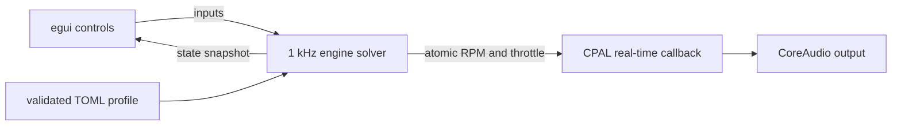

# Architecture

## Runtime flow

## Boundaries

- `config`: version-controlled engine data and strict validation.
- `simulation`: deterministic, unit-testable SI-unit physics with no UI or audio dependency.
- `audio`: allocation-free callback; it reads state through atomics and never locks the UI thread.
- `app`: input, presentation, timing accumulator, and graceful audio failure handling.
- `logging`: daily diagnostic logs plus a synchronous crash report and backtrace.

The physics runs at a fixed 1 ms step. Rendering is approximately 60 Hz and cannot change the
simulation result. Frame gaps are capped at 50 ms to avoid a runaway catch-up loop.

The setup editor uses a draft-and-apply transaction: all values validate together, invalid edits
leave the active model untouched, and valid changes preserve current RPM and controls. Displacement
scales the calibrated torque, pumping loss and rotating inertia from the reference displacement.

## Accuracy model

The first slice is a lumped rotational model with an explicit 720-degree four-stroke cycle:
intake, compression, power and exhaust. Combustion torque follows the cylinder firing phase and
a configurable curve; intake manifold pressure and throttle/manifold lag determine air charge.
Starter torque, mechanical friction, RPM-dependent pumping loss, flywheel inertia, rear-wheel
load reflected through the selected ratio, clutch engagement and an idle controller all affect
crank acceleration. Closed-throttle overrun cuts combustion above the idle region. Sound is
generated from firing events, damped exhaust modes, combustion noise and a mechanical harmonic.
The bundled inline four uses even 180-degree firing intervals; intake and exhaust envelopes are
separate, and fuel-cut overrun only produces sparse deterministic pops.

The dashboard's bike strip uses simulated, integrated travel distance. Crank and wheel inertia are
separate; clutch capacity and slip transfer torque through the selected ratio, including a low-rpm
stall guard when a fully coupled tall gear overwhelms the idle torque reserve. A fixed rear-axle
normal load produces tarmac rolling resistance, speed-dependent aerodynamic drag acts at the
wheel, and a static dry-tarmac friction cap prevents impossible drive or braking torque. This makes
pull-away, shifts and engine braking causal without an artificial user-controlled dyno load.

It deliberately does **not** claim cylinder-pressure, thermal, emissions, lubrication or
finite-element accuracy. Those require measured data and validation rather than additional UI.

## Next modelling stages

1. Replace the calibrated power pulse with measured crank-angle-resolved cylinder pressure.
2. Add volumetric efficiency, ignition timing and throttle-body airflow.
3. Add clutch thermal state, shift interruption and tyre-road slip.
4. Add coolant/oil temperatures and temperature-dependent friction.
5. Calibrate against a real torque curve, idle recording and exhaust spectrum.

Each stage should introduce reference data, unit tests and an explicit error metric before the
next stage starts.

## Security and real-time rules

- Engine files are data only; they are never executed.
- Every external numeric value must be finite, bounded and validated before entering the solver.
- The audio callback must not allocate, lock, open files, log routinely or perform network I/O.
- Dependencies stay minimal; run `cargo quality`, `cargo verify` and dependency auditing in CI.
- Generated recordings are ignored by Git to prevent accidentally committing large user files.
- Logs avoid continuous telemetry and remain on the local machine.
